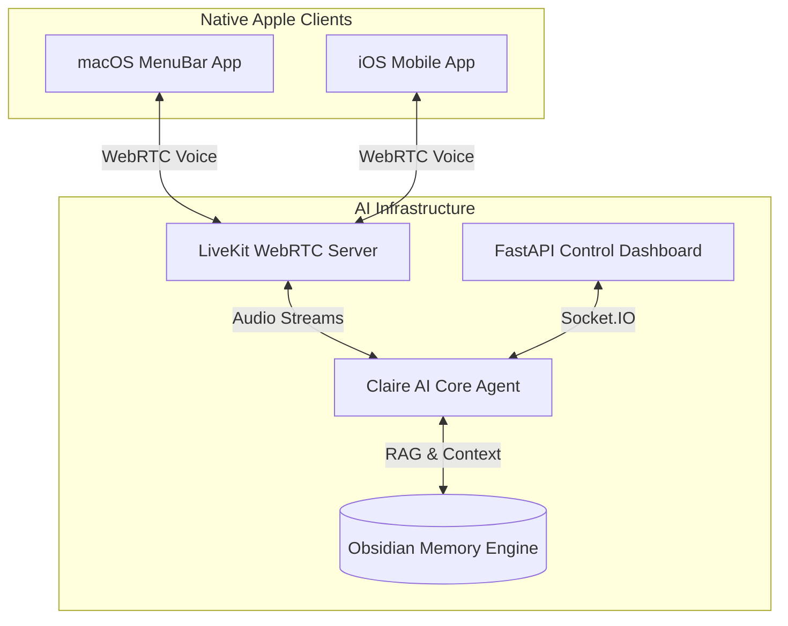

<div align="center">
  <h1>🌌 Claire V2.5</h1>
  <p><b>Next-Gen Native Conversational AI & Realtime Voice Agent</b></p>
  
  [](https://www.python.org/)
  [](https://swift.org)
  [](https://fastapi.tiangolo.com/)
  [](https://livekit.io/)
  []()
</div>

<br/>

## 🎯 Executive Summary (Business Value)

**Claire V2.5** is not just another chatbot—it is a fully integrated, scalable **Conversational AI System** designed for enterprise use-cases. By combining a low-latency Python backend (via LiveKit/WebRTC) with highly optimized native Apple clients (macOS & iOS), Claire delivers a seamless, human-like voice interaction experience.

For businesses, this architecture enables:
- **Ultra-Low Latency:** Real-time voice interaction (~200ms) over WebRTC.
- **Stateful Memory:** Obsidian-style "Masterakte" long-term memory for contextual customer/user interactions.
- **Cross-Platform Scalability:** A monorepo structure cleanly decoupling the AI backend from the native frontend apps.
- **Emotional Intelligence:** Integrates advanced TTS (ElevenLabs/Cartesia) with real-time emotion mapping.

---

## 🏗️ Enterprise Architecture

The system utilizes a modern, event-driven micro-architecture decoupled via WebSocket and WebRTC.



### 📁 Repository Structure

```text
claire-v2.5-native-audio/
├── backend/                  # 🧠 Python AI Backend (LiveKit, FastAPI, LLM Routing)
│   ├── claire.py             # Main Voice/Vision/Context Agent
│   ├── dashboard.py          # FastAPI & Socket.IO Dashboard
│   └── persona.py            # RAG & Memory Manager
├── apps-workspace/           # 🍏 Native Apple Clients (Xcode)
│   ├── ClairemacOS/          # SwiftUI macOS MenuBar Client
│   └── ClaireiOS/            # SwiftUI iOS Mobile Client
└── docs/                     # 📚 System Blueprints & API Docs
```

---

## 🛠️ Technology Stack

| Layer | Technologies |
|-------|-------------|
| **AI & LLM** | OpenAI GPT-4o, Prompt Engineering, RAG |
| **Voice & Audio** | LiveKit Agents Framework, WebRTC, ElevenLabs / Cartesia TTS |
| **Backend API** | Python 3.12+, FastAPI, Uvicorn, asyncio, Socket.IO |
| **Native Clients**| Swift 5+, SwiftUI, Xcode, Apple AVFoundation |
| **Data & Memory** | JSON/Markdown Local Knowledge Graphs (Obsidian-style) |

---

## 🚀 Quick Start Guide

### 1️⃣ Backend Setup (AI Core)

Requires LiveKit keys and AI provider API keys configured via environment variables (`.env`).

```bash
cd backend
python3 -m venv venv
source venv/bin/activate
pip install -r requirements.txt

# 1. Start the LiveKit Voice Agent
python3 claire.py start

# 2. Start the Control Dashboard (in a separate terminal)
python3 dashboard.py
```
> The Control Dashboard is available at `http://localhost:8000`

### 2️⃣ Native Clients Setup (macOS / iOS)

```bash
open apps-workspace/Claire.xcworkspace
```
1. Select target `ClairemacOS` or `ClaireiOS` in Xcode.
2. Build and Run (`⌘ + R`).

---

## 🧠 Advanced Features: The Control Dashboard

The included Control Dashboard acts as the Command Center for AI tuning:
- **Obsidian Persona Archive:** Inject character traits and background stories via structured Markdown.
- **Context Extractor:** Automatically parse raw text into structural knowledge for the AI's long-term memory.
- **Real-Time Voice Controls:** Adjust speech rate, emotional intonation, and interruptions on the fly.
- **Audit & Logging:** Export conversation logs for compliance or fine-tuning.

---

## 💼 About the Architect (Available for Freelance)

Built and architected by **Kevin Kuck**. 
I specialize in bridging the gap between cutting-edge Artificial Intelligence and polished, native Apple ecosystems. 

**Looking for an expert to build or scale your next AI product?**
- 👨‍💻 **Role:** IT-Support Specialist | AI Architect | Apple Developer
- 📄 **Interactive CV & Portfolio:** [CV_IT_KKEEY](https://kkeey92.github.io/CV_IT_KKEEY/)
- 🤝 **Hire Me:** Available for freelance consulting, architecture design, and full-stack AI development.

> *"Turning complex AI research into robust, user-facing enterprise products."*
- 👔 **LinkedIn:** [Kevin Kuck](https://www.linkedin.com/in/kevin-kuck-it)
- 🦊 **GitLab:** [KKEEY92](https://gitlab.com/KKEEY92)
