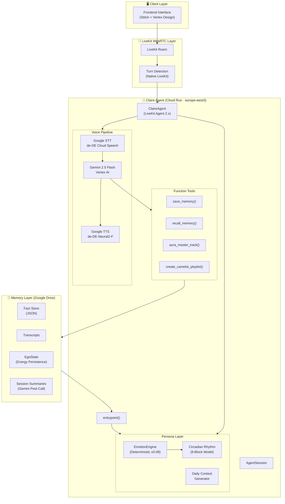

<div align="center">


<br/>
<br/>

# 🎙️ CLAIRE V2

### Autonomous Voice AI Agent · Emotion Engine · Real-Time Audio Intelligence

*A fully autonomous, emotionally aware voice AI agent with persistent memory,  
circadian rhythm simulation, and professional-grade audio intelligence.*

</div>

---

## ⚠️ Copyright Notice

> **© 2026 Kevin Kuck — All Rights Reserved.**  
> This project, including its AI persona design, EmotionEngine architecture, system prompts, and all source code, is proprietary intellectual property. Unauthorized use, reproduction, or distribution is strictly prohibited. See [`LICENSE`](./LICENSE) for full terms.

---

## 📋 Overview

**Claire V2** is a production-grade, real-time voice AI agent built on the LiveKit Agents 2.x framework. Claire is not a generic chatbot — she is a fully realized AI persona with a deterministic emotional state system, persistent cross-session memory, and deep audio/music domain expertise.

### Core Differentiators

| Feature | Description |
|---|---|
| 🧠 **EmotionEngine** | Deterministic energy-level system (0.0–1.0) with ±0.08 clamp per turn |
| ⏰ **Circadian Rhythm** | 8-block daily energy model simulating natural human energy cycles |
| 💾 **Persistent Memory** | Cross-session fact storage via Google Drive RAG |
| 🎵 **AuraTone DSP** | Audio processing intelligence (LUFS, Camelot, Traktor Pro 4) |
| ☁️ **100% Cloud Pipeline** | Zero local GPU dependency — full Google Cloud stack |
| 🔒 **Post-Call Analysis** | Automatic transcript summarization with Gemini 2.5 Flash |
| 📞 **LiveKit Call UI** | Connection state machine, German status labels, retry on error |
| 📊 **Live Analytics** | Real-time facts, turns, and session duration via telemetry |
| 🎚️ **Voice Visualizer** | Web Audio API analyser driven by Claire's actual audio output |

---

## 🆕 Recent Updates (June 2026)

| Area | Change |
|---|---|
| **Frontend** | LiveKit connection state machine (`idle` → `token_fetch` → `connecting` → `connected` / `error`) with German UI and **Erneut verbinden** retry |
| **Hang-up** | `disconnect()` tears down the LiveKit room, stops mic tracks, and resets Zustand store (no zombie sessions) |
| **Telemetry** | Agent sends `factsCount`, `turnCount`, `sessionSeconds`; Analytics view shows live data (`mm:ss` session time) |
| **Visualizer (B3)** | Replaced synthetic FFT with real `AnalyserNode` on remote audio via lazy singleton `AudioContext` |
| **Repo** | Legacy `claire-v2-frontend/` archived under `_archive/`; active app is `src/` at project root |
| **Dependencies** | `livekit-agents[google]` only — Deepgram/ElevenLabs/Silero extras removed (RAM optimization) |
| **Docs** | `ZUSTANDSBERICHT_2026-06-04.md`, `CLAIRE_V2_Aenderungsbericht.pdf` (change report) |

---

## 🏗️ Architecture



---

## 📁 Project Structure

```
00_CLAIRE_V2_APP/          # Project root (this repository)
├── src/                   # Active frontend (Vite + React + TypeScript)
│   ├── App.tsx
│   ├── components/        # Call, AuraTone, Analytics, Dashboard
│   ├── hooks/             # useLiveKit.ts
│   └── stores/            # emotionStore (Zustand)
├── index.html
├── package.json
├── vite.config.ts
├── agent.py               # LiveKit voice agent – main backend entrypoint
├── persona.py             # EmotionEngine, EgoState, CircadianRhythm
├── memory.py              # DriveMemory – persistent RAG via Google Drive
├── token_server.py        # Local LiveKit JWT token server (dev)
├── brain_test.py          # Isolated core logic – text-only validation
├── requirements.txt       # Python dependencies (Google-only LiveKit extras)
├── .env.example           # Environment variable template (safe to commit)
├── .gitignore
├── LICENSE
├── ZUSTANDSBERICHT_2026-06-04.md   # Project status & improvement plan
├── CLAIRE_V2_Aenderungsbericht.pdf # PDF change report (session work)
├── _archive/              # Retired artifacts (not used in production)
│   └── claire-v2-frontend/  # Legacy Vite counter template (archived)
└── .agents/
    └── rules/
        └── workspace.md   # Development pipeline (4-phase workflow)
```

---

## 🚀 Tech Stack

### Backend & AI
| Component | Technology | Version |
|---|---|---|
| **Runtime** | Python | 3.13+ |
| **Voice Framework** | LiveKit Agents | 2.x |
| **LLM** | Gemini 2.5 Flash (Vertex AI) | latest |
| **STT** | Google Cloud Speech-to-Text | Neural / Chirp |
| **TTS** | Google Cloud Text-to-Speech | Neural2-F (de-DE) |
| **AI SDK** | google-cloud-aiplatform | ≥1.71 |
| **Async Runtime** | asyncio (Python native) | — |

### Infrastructure
| Component | Technology |
|---|---|
| **Cloud Provider** | Google Cloud Platform |
| **Deployment Region** | europe-west3 (Frankfurt) |
| **Compute** | Cloud Run (serverless) |
| **Memory/RAG** | Google Drive API |
| **Real-time Transport** | LiveKit (WebRTC) |

---

## ⚙️ Setup & Installation

### Prerequisites
- Python 3.13+
- Google Cloud Project with Vertex AI API enabled
- LiveKit Cloud account (or self-hosted server)
- Google Drive API credentials (for memory persistence)

### 1. Clone & Environment

```bash
git clone https://github.com/KKEEY92/claire-v2.git
cd claire-v2
python3.13 -m venv .venv
source .venv/bin/activate
pip install -r requirements.txt
```

### 2. Configure Environment

```bash
cp .env.example .env
# Edit .env with your credentials – NEVER commit this file!
```

Required variables:

```env
GOOGLE_CLOUD_PROJECT=your-gcp-project-id
GOOGLE_CLOUD_LOCATION=europe-west3
GOOGLE_GENAI_USE_VERTEXAI=1
LIVEKIT_URL=wss://your-server.livekit.cloud
LIVEKIT_API_KEY=your-api-key
LIVEKIT_API_SECRET=your-api-secret
```

### 3. Google Cloud Authentication

```bash
gcloud auth application-default login
gcloud config set project $GOOGLE_CLOUD_PROJECT
```

### 4. Frontend (Vite + React)

```bash
npm install
cp .env.example .env   # set VITE_LIVEKIT_URL, VITE_LIVEKIT_TOKEN_ENDPOINT
npm run dev            # http://localhost:5173
```

Token server (separate terminal — see comments in `requirements.txt`):

```bash
pip install flask livekit-api
python token_server.py
```

### 5. Run Locally

```bash
# Validate core logic (text-only, no audio)
python brain_test.py

# Run full voice agent (requires LiveKit room)
python agent.py start
```

### Frontend views

| View | Route / Tab | Status |
|---|---|---|
| **Call** | `call` | LiveKit connect, German status, retry, Web Audio visualizer |
| **AuraTone** | `auratone` | Visual shell (Camelot wheel) |
| **Analytics** | `analytics` | Live facts count, session time, conversation turns |

---

## 🔒 Security

### Secrets Management
- **All API keys** are stored exclusively in `.env` (gitignored)
- `.env.example` provides a safe template with zero real credentials
- `service_account.json` and all credential files are gitignored by pattern
- Memory transcripts containing personal data are excluded from version control

### Data Privacy
- Conversation transcripts are stored only in your private Google Drive
- No telemetry, no third-party data sharing
- Personal context (memory facts) remains within your GCP project boundary

### Dependency Security
- Pin all dependencies with minimum version constraints in `requirements.txt`
- Regularly audit with: `pip audit`

### Threat Model
| Risk | Mitigation |
|---|---|
| API key exposure | `.gitignore` + `.env` pattern + `.env.example` |
| Personal data leakage | Memory/transcript paths gitignored |
| Unauthorized model access | GCP IAM + Vertex AI service account scoping |
| Prompt injection | System prompt is server-side only, never client-exposed |

---

## 🚀 Deployment (Cloud Run)

```bash
gcloud run deploy realtime-agent \
  --source . \
  --region europe-west3 \
  --allow-unauthenticated
```

---

## 🛠️ Development Pipeline

This project follows a strict 4-phase development workflow:

| Phase | Focus | Status |
|---|---|---|
| **Phase 1** | Isolated core (`brain_test.py`) – EmotionEngine, Tool Calling, Drive RAG | ✅ Done |
| **Phase 2** | Backend & LiveKit wrapper (`agent.py`) – Google STT/TTS, telemetry | ✅ Done |
| **Phase 3** | Frontend – Call UI, connection FSM, analytics, audio visualizer | 🟡 Core done, AuraTone polish open |
| **Phase 4** | Documentation & Cloud Run Deployment | 🔄 In Progress |

---

## 📄 License

**© 2026 Kevin Kuck — All Rights Reserved.**

This project is **proprietary software**. No license is granted for use, modification, or distribution without explicit written consent from the copyright holder.

See [`LICENSE`](./LICENSE) for the full proprietary license terms.

---

<div align="center">

*Built with precision by Kevin Kuck · Powered by Google Cloud · Frankfurt, Germany*

</div>
